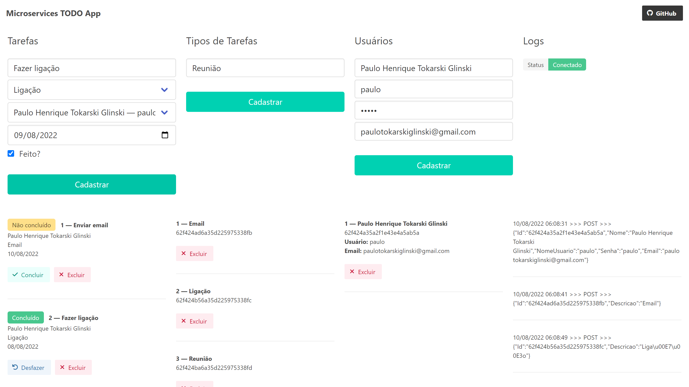

# microservices-todo-app

Application based on microservices architecture with Angular, .NET, MongoDB, RabbitMQ, SignalR and Ocelot.

## About

The application demonstrates the microservices architecture based on the containerized microservices-oriented application pattern provided by [Microsoft](https://learn.microsoft.com/en-us/dotnet/architecture/microservices/multi-container-microservice-net-applications/microservice-application-design).

This application lets you keep track of tasks, type of tasks, users and monitor logs.



## Microservices

- Gateway `dotnet-gateway-ocelot`
- Tasks `dotnet-todo-api`
- Type of Tasks `dotnet-tipotarefa-api`
- Users `dotnet-usuario-api`
- SignalR `dotnet-todo-signalr`

Front-end containers, RabbitMQ and MongoDB databases are also instanced.

Task, type of tasks and users APIs access their respective database, also containers (mongodb-1, mongodb-2, mongodb-3).

The frontend communicates with the APIs solely through the Gateway and receives log notifications through SignalR.

Communication between microservices is done through the Gateway and RabbitMQ channels (consumer and producer).

## How to start

- Have previously installed Docker on your computer
- Clone this repository ```git clone https://github.com/paulotokarskiglinski/microservices-todo-app```
- Inside the project folder, run the command ```docker-compose up -d --build```
- In your browser, access ```http://localhost:8080```
- It's up and running!